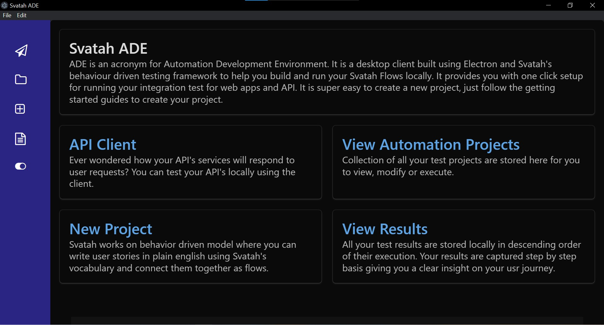
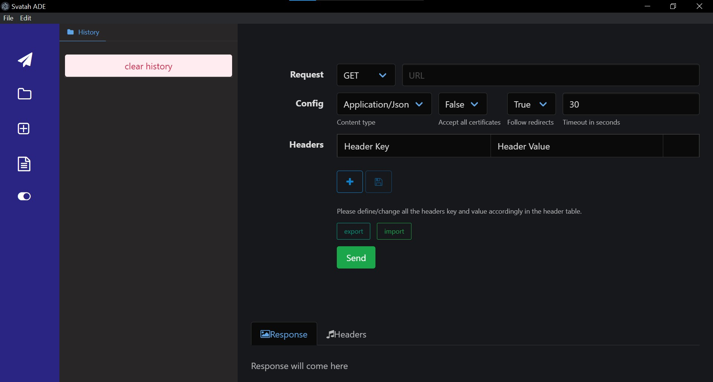
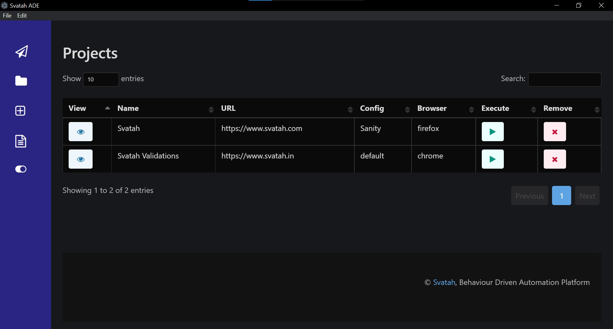
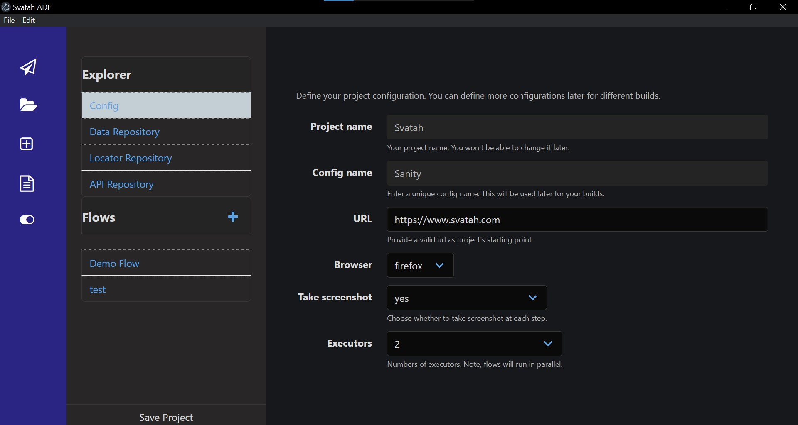
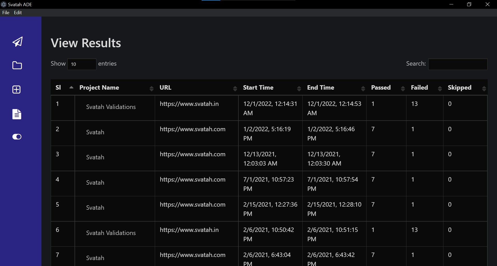

### Svatah Automation Development Environment

[Watch, How to create your project's automation under 5 minutes.](https://www.youtube.com/watch?v=U2kegQUdGpQ&feature=youtu.be)

#### Overview

Svatah is a scalable, robust, cloud based platform which is imbibed in the behavior driven philosophy. Svatah enables you to rapidly design your test and supercharges your execution. Svatah’s purpose is to allow you to easily automate the tasks of functionally validating any User Interface in language agnostic format using its algorithms so anyone can focus more on development rather than on scripting for regression.

#### About Svatah ADE

Svatah ADE is a desktop client built using Electron and Svatah's core to help you build and run your Svatah Flows locally. It provides you with one click setup for running your integration test for web apps and API. It is super easy to create a new project, just follow the getting started guides to create your project. To download the client go to [releases](https://github.com/a-t-u-l/svatahADE/releases) section and download the appropriate installer for your OS.

Svatah ADE also includes an API client to validate your requests which you want to include in your project.

Project View

Add new Project

View Results

### What's New with v1.1.0

* Refreshed look with dark theme support.
* Upgraded dependencies with shiny new interface.
* A view manager which eliminates the need to reload the view while switching tabs.
* Updated base test framework. 

> Please note : as the build does not have signed certificate from app/windows store it might give security warning during installation. You can ignore it.

#### Documentation

* [First Project](/docs/README.md)
* [Writing story for tests](/docs/storyMode.md)
* [How Svatah Works](/docs/howSvatahWorks.md)
* [API Repository](/docs/apiRepository.md)
* [API Client](/docs/apiClient.md)
* [Reference](/docs/_navbar.md)

#### Building/Contributing to Svatah ADE client

Svatah ADE uses node with yarn to manage the project build process. To get started you would need to clone the repository and install the packages using yarn.

`yarn install`

Once you get all the node modules, you can follow ELectron guides to understand the project structure. You can make necessary changes and build the project. Svatah ADE uses Electron forge to build the client. To validate your changes execute :

`electron-forge start`

And, that's it Svatah ADE would start with your changes in place. As electron compile supports hot reload, any changes you make to js/css/html would come to the app once you refresh it. Once you are done you can build the app for your platorm (mac/windows/linux) using :

`npm start`

Have any queries? Please reach out using email : maitto:info@svatah.com
