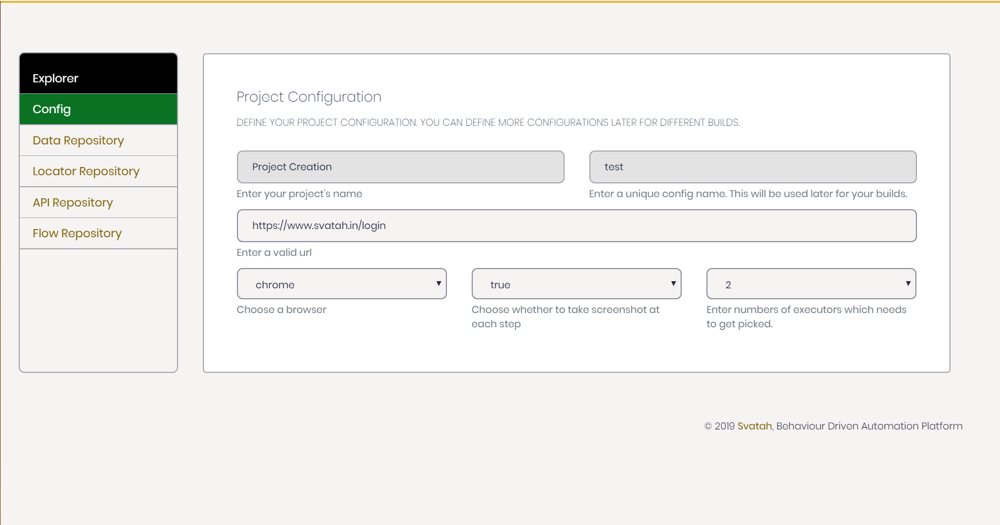
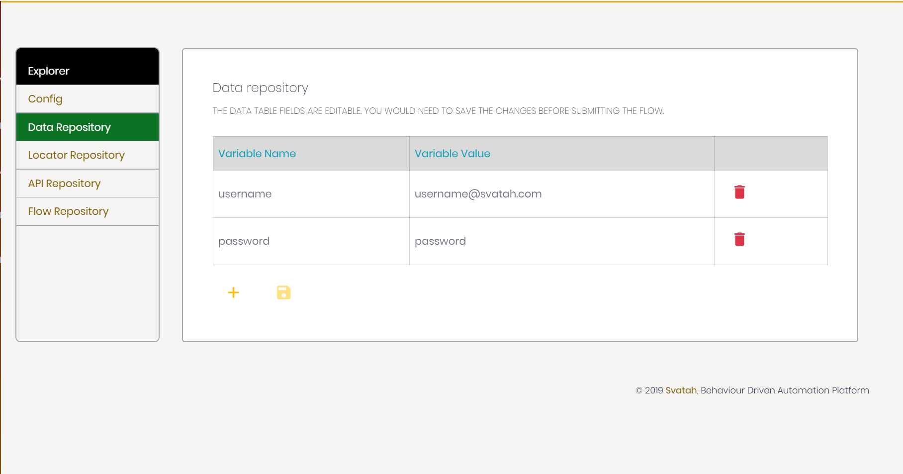
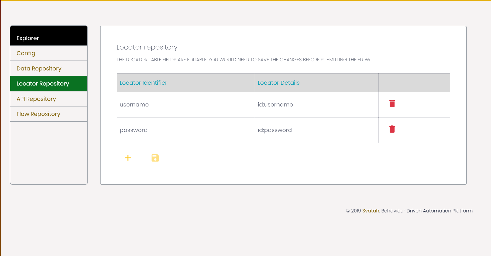
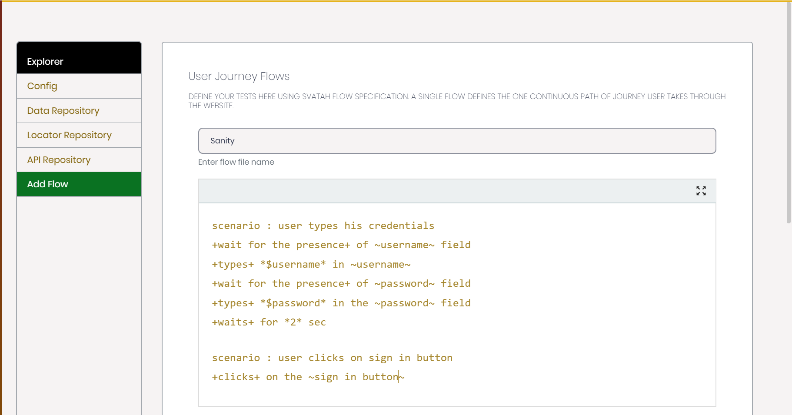

# Getting Started With Svatah

> Svatah’s purpose is to allow you to easily automate the tasks of functionally validating any User Interface in language agnostic format using its algorithms so anyone can focus more on development rather than on scripting for regression.

### Creating New Project

On the side menu you can see a menu option 'New Project'. Clicking on it will take you to add new project view. Here you can define minimum set of information to create a test project. Let's walk through them.

#### Default Project Configuration Section



|Field| Description|
|------|------|
|Project Name|	Project name acts as the identity for this project and it must be unique. Once created you can't change it.|
|Config Name|	Config name acts as the identity for the details in Config section and it must be unique. Once created you can't change it.|
|URL|	This URL represents starting point of execution. All of your flows start by loading this url in browser and then executing the steps you have defined in the flow.|
|Browser|	Here you can choose which would be your default browser to execute project. you can defined different configurations later. Currently you have two options Chrome and Firefox.|
|Step Screenshot|	This boolean field represents whether you would like to see each step take a screenshot for report while executing. Great for documentation purposes.|
|Number of threads|	You can choose number of executors you would require for the project. Flows are designed to run in parallel so greater number of threads mean faster execution.|

---

#### Data Repository section



Here you can store all of your test data at one place which offers its re-usability across project for different flows. Data repository acts as a global data map for your flows data spec and its value can not be changed at run time. For run time you need to define a variable using `var` keyword.

#### Locator Repository section



Here you can store all of your test locators at one place which offers its re-usability across project for different flows. Moreover you can use dynamic location strategy to reduce test flakiness.  

#### API Repository section


Here you can store all of your test API at one place and invoke it from the flow steps. It allows you to invoke the api and use its data in UI scenarios. Refer [API Repository](apiRepository.md) for more details.

#### Add Flow Section



Here you can define all of your user journey which acts as flows for the project and gets executed. A flow is sequential set of steps which a user takes during his journey through the website. Please refer [How Svatah Works](howSvatahWorks.md) to understand its basics.  

### First Project

You can try creating your first project as below :

##### Project Configuration
`URL : https://www.svatah.in/login`

##### Locator Repository
```
username = id:username & xpath://input[@id='username'] & cssSelector:#username
password = id:password & xpath://input[@id='password'] & cssSelector:#password
login button = xpath://input[@value='Sign In']
dashboard link=xpath://a[contains(text(),'Dashboard')] & cssSelector:css=div > a.nav-link.js-scroll-trigger
Schedule Build Tab = xpath://li[4]/a/p & cssSelector:li.build > a > p
Schedule Build Title = xpath://h1 & cssSelector:h1
```

##### Flow

Please change email and password from below flow.

```
scenario : Validate Text
user +types+ the ~username~ as *<PUT YOUR SVATAH REGISTERED EMAIL>*
then she +types+ the ~password~ as *<PUT YOUR SVATAH PASSWORD>*
then she +clicks+ the ~login button~
she then +waits+ for *2* seconds
she then +clicks+ on the ~dashboard link~
she then +clicks+ the ~Schedule Build Tab~
she tries to +validate Text+ of ~Schedule Build Title~ with *Enterprise.*
Now you can execute this project.
```

You are now ready to start creating new Projects. Please go through the flow creation docs for better understanding.
