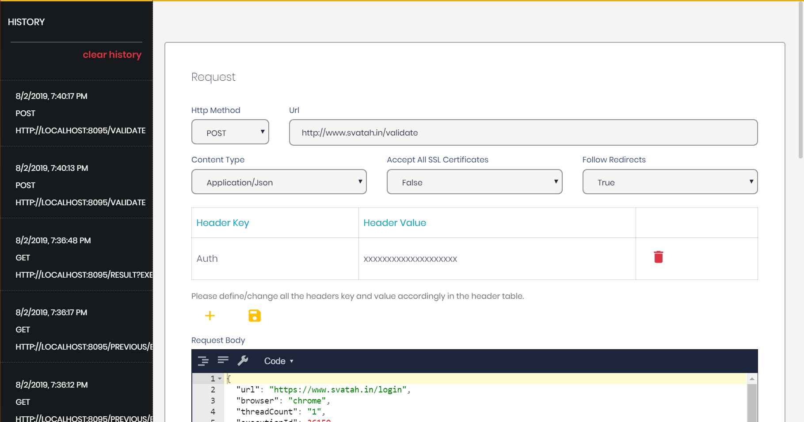

### API Client

While automating your UI behaviours we get the need to fetch certain data or invoke certain actions using APIs. To handle these scenarios Svatah provides support for invoking APIs within your projects.

Svatah ADE includes an API client to validate your requests which you want to include in your project.

