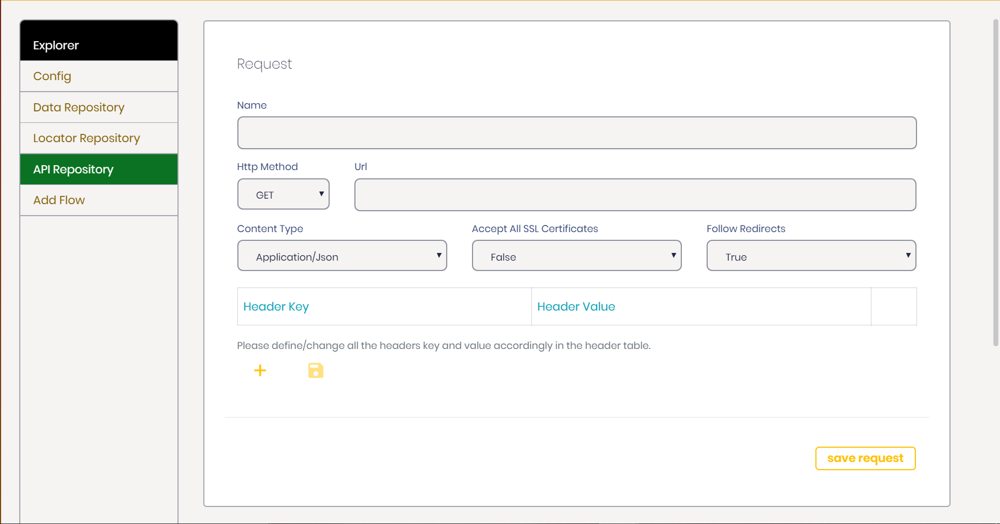

### Using API calls along with UI tests

> Understanding how you could integrate your UI automation with necessary backend API calls.

#### API use case and know how
While automating your UI behaviours we get the need to fetch certain data or invoke certain actions using APIs. To handle these scenarios Svatah provides support for invoking APIs within your projects. Once you create your project you can go to project detailed view where you can add your set of APIs in the Project API Repository.

#### Adding a API
After creating you project go to my projects section and view your project. In project view go to API Repository section and click on add new API button. You should be able to see a view like this:



To extract information from API response and use it across project you can define a variable as `var : varName`. This would automatically save the entire response. If you want to save a specific data you can pass a JsonPath expression to get that data. For example, if your API response is something like :

```json
{

"email" : "demo@svatah.com",

"token" : "qwerty"

}
```

you can use json expression `$.email` to get email value. Now you can use this variable `email` as input to another step using input expression : `*#email#*` expression for saving value in a variable.

```
var ( $.email ) : email 
Action Expression :
+invoke+
Identity Declaration :
~Specified API Name~
Extracting Data from response :
var(<Json Path Expression >) : varName
You are now ready to start adding APIs to your flows.
```