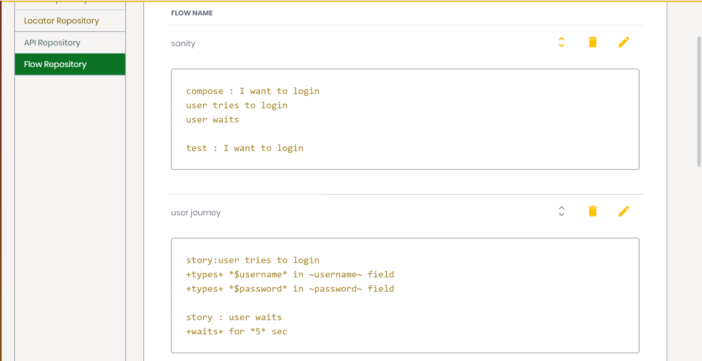

### Story mode

Story mode takes your test creation to next level. A story is smallest collection of steps which can define a user or business behaviour. Once you define this you can combine multiple stories together to compose a chapter. these compositions then can be executed using a test.



#### Story
A typical story consist of multiple steps definitions which would be executed sequentially. A story is similar to a scenario where it is a logically modular grouping of steps which makes up a business functionality but a story in itself is not executable. A story must have unique name across the project as a story can be reused by another flow. A typical story looks like:

```
story : I want to login
+type+ the username *user@svatah.com* in field ~id:username~
+type+ the password *abcd1234* in ~id:password~
+click+ on the login button using ~xpath://input[@value='Sign In']~

story : I want to go to schedule build page
+click+ on the Schedule Build using ~xpath://li[4]/a/p~
+validateText+ on the Schedule Build Page using ~xpath://h1~ with *Schedule*
```

#### Composing a chapter full of stories

Once you have created your stories for the project you can bind them together using compositions. A composition is grouping to sequential stories which tells us about the specific part of the user journey. This would look like:

```
compose : I want to verify text on schedule page
I want to login
I want to go to schedule build page
```

Not only this you can nest a composition or a scenario as a step on another composition. Only condition is that all of these steps must follow a logical execution order. Once you are done you can execute this composition as :

```
test : I want to verify text on schedule page
```

You are now ready to start creating your own flows using story mode.